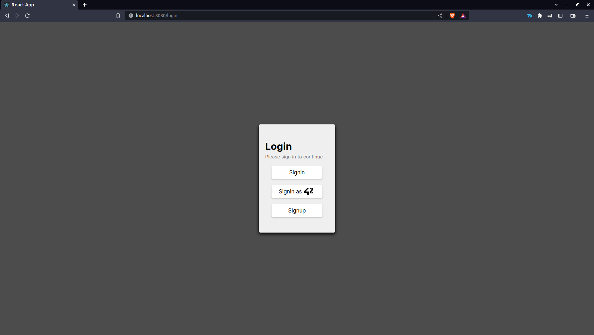
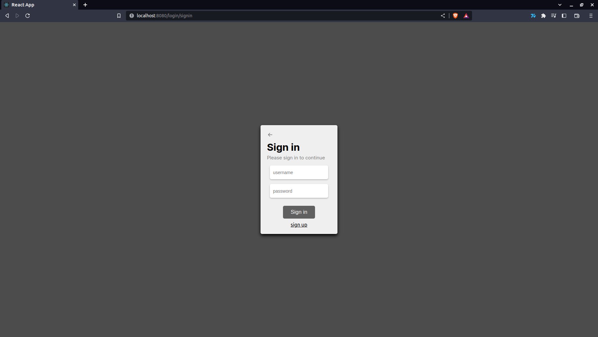
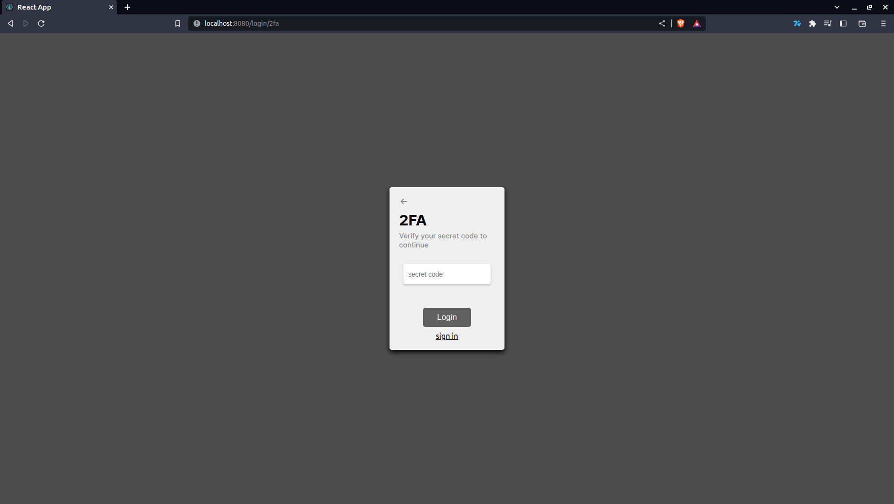
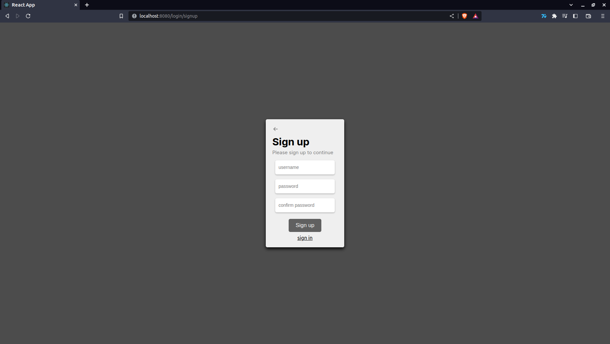
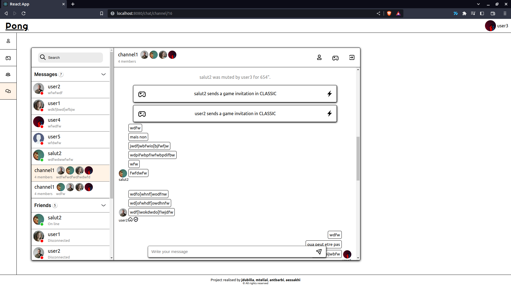
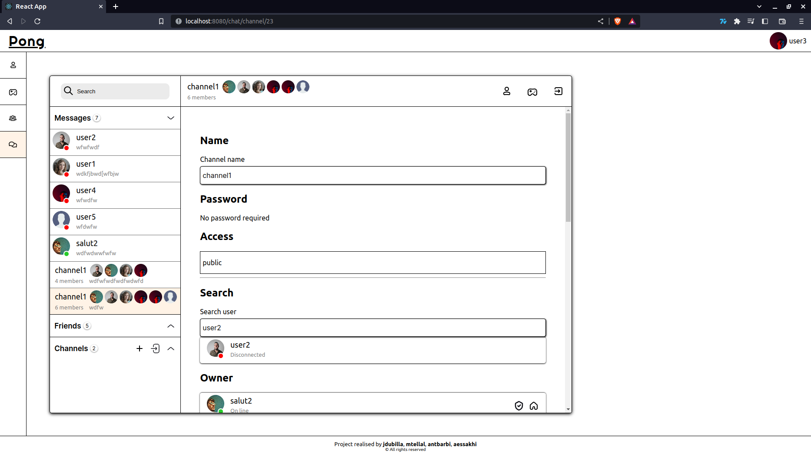

# ft_transcendence

## FRONTEND 
`http://localhost:8080`

We decided to use a maximum of functionalities provided by react in order to understand the functionalities and the concepts used by this library.
The application run on `http://localhost:8080` and is in production. 

#### What we used
- **Routing**  
To route our application, we decided to use the library `react-router`. In fact, this library emerged from our research and imposed itself as a must-have for react single page application. 

- **State management**  
  As said previously, we wanted to use the native functionalities offered by the React library. That's why we choose to only use `context` and `reducer` to manage the states of our application.
  After a few headaches and some incomprehensions, especially on the chat part, we finally managed to use these apis effectively.
   
  
- **Socket**  
  For our first time to use sockets we decide to pick `socket.io` library, like react-router she stands out from our research, especially for conciseness and his simplicity.
   
  
- **HTTP Queries**  
  For our calls with the backend API we decided to use `axios`, in particular because calls are less verbose than the XMLHtppRequest API of JavaScript, as well as for its simplicity in manipulating the fields of the header. After reflection, it would have been preferable to use the api in order to better understand, in details, how XMLHttpRequest requests and the ajax approach work.

## Docs:

### REACT
- https://react.dev/ - React official doc 
- https://stackoverflow.com/questions/54576865/when-to-use-native-react-usereducer-hook-and-how-it-differentiate-from-redux - When to use `useReducer` or `Redux`

### CSS 
- https://github.com/suitcss/suit - suitCSS - naming convention used by twitter 
  ##### BEM
  - https://yandex.com/dev/bem/ - BEM naming convention 
  - https://webuild.envato.com/blog/how-to-scale-and-maintain-legacy-css-with-sass-and-smacss/ 
  - https://www.york.ac.uk/pattern-library/about/css.html 

#### AJAX / HTTP POLLING
- https://advancedweb.hu/how-to-use-async-functions-with-array-map-in-javascript/ - Async map array of promises + explications async/sync processes
- https://stackoverflow.com/questions/12555043/my-understanding-of-http-polling-long-polling-http-streaming-and-websockets

#### Typescript 
- https://mattbatman.com/typescript-and-webpack-and-images - import resolve tsc and webpack

#### Web sockets
- https://javascript.info/websocket -Websocket API

#### Session / Local / Cookies
- https://blog.logrocket.com/storing-retrieving-javascript-objects-localstorage/ - Local Storage / Sessions Storage / Cookies
- https://stackoverflow.com/questions/19183180/how-to-save-an-image-to-localstorage-and-display-it-on-the-next-page - Serialize an image (in canvas) into Local Storage
- https://dev.to/rdegges/please-stop-using-local-storage-1i04 - Bad use cases of Local Storage 
  ##### More docs (security / XSS / local storage / session / cookies)
  - https://cheatsheetseries.owasp.org/cheatsheets/HTML5_Security_Cheat_Sheet.html#Local_Storage
  - https://jwt.io/ - javascript web token (encode data structure into a jwt)
  - https://blog.codinghorror.com/protecting-your-cookies-httponly/ - cookies and xss attack
  - https://michalzalecki.com/why-using-localStorage-directly-is-a-bad-idea/ - local storage errors safari / chrome and others ...

## BACKEND 
`http://localhost:3000`

## Docs:

#### General NestJS documentation
- [Nestjs Docs](https://docs.nestjs.com/)

#### Building a REST API
- [Build a REST API with NestJS and Prisma](https://www.youtube.com/watch?v=LMjj1_EK4y8) - Used to create a basic User module with CRUD endpoints

#### Uploading
- [Blog Project - NestJS](https://www.youtube.com/playlist?list=PLVfq1luIZbSnytbsm2i8Ocf_hyUHTsqbZ) - Great playlist about creating a blog using NestJS. Very useful infos about image uploading, using AuthGuard to protect endpoints

#### Authentification
- [Authentification using Prisma and NestJS](https://www.prisma.io/blog/nestjs-prisma-authentication-7D056s1s0k3l) - Implementing authentification in a REST API

#### Realtime Chat with Websockets
- [Realtime Chat App](https://www.youtube.com/playlist?list=PLVfq1luIZbSkICzoA8EuvTskPEROS68i9) - Playlist about creating a realtime chat app using NestJS.
- [Real-time chat with WebSockets](https://wanago.io/2021/01/25/api-nestjs-chat-websockets/)
- [Socket.io JWT](https://www.npmjs.com/package/socketio-jwt)

## Sockets:

### Events

#### Users Gateway

The Users Gateway doesn't listen to any events, however it emits:
- updatedFriend: will send an updated User object to every user of a friendlist in case of update (profile picture, name...)

- updatedMember: will send an updated User object to every user of every channel joined by the user

- receivedRequest: will be sent to the recipient of a friend request once it is posted

- addedFriend: will be sent to the user who sent the friend request only if it is accepted

- removedFriend: will be sent to the user if he has been removed from a friend list

- blockedUser: will be sent to the user who blocked someone with the blocked object

- unblockedUser: will be sent to the user who unblocked someone with the userId of the unblocked user

- acceptedInvite: will be sent to both users once a game invite has been accepted with the corresponding Game object

#### Chat Gateway

Channel creation is done through a request, once a channel is created, a 'newChannel' event is emitted to every member of the newly created Channel

The backend listens to these events: 
- 'message': Takes the channelId and the content of the message in the dto. Message will be emited only to the users of that room through a 'message' event

- 'joinChannel': Takes a channelId and a password (optional). Join the given channel. Will emit 'joinedChannel' to the room when the User is added to the Channel in the db

- 'addtoChannel': Takes a channelId and a userId. Only administrators can add someone to a channel. Will emit 'addedtoChannel' to the room and to the newly added User

- 'leaveChannel': Takes a channelId. Will emit 'leftChannel' to the room and 'ownerChanged' if the user who left was the owner of the Channel

- 'kickUser', 'banUser': Takes a channelId, userId and a reason (optional). Administrators can use admin actions on members and owner can use admin action on anyone. Emits a 'kickedUser' event

- 'muteUser': Takes a channelId, userId, a duration and a reason (optional). A muted user can't send messages to the given channel. Emits a 'mutedUser' event to the room

- 'unmuteUser': Takes a channelId and a userId. Only an admin can unmute a User and only an owner can unmute an admin. Emits a 'unmutedUser' to the room

- 'banUser': Takes a channelId, userId and a reason (optional). Emits 'bannedUser' to the room and forcibly removed the User from the channel via socket.leave(...)

- 'unbanUser': Takes a channelId and a userId. Emits 'unbannedUser' to the room.

- 'makeAdmin': Takes a channelId and a userId. Only the owner can make someone else admin. Emits 'madeAdmin' to the room

- 'removeAdmin': Takes a channelId and a userId. Emits 'removedAdmin' to the room

- 'updateChannel': Takes a channedId and a name (optional) or a type (optional) or a password (optional). Emits 'updatedChannel' to the room with the updatedChannel object

- 'sendInvite': Takes a channelId and a gametype in the dto. Can't send an invite if muted. Emits the invite as a message with the type INVITE and the gameId of the newly created game room as content

- 'acceptInvite': Takes a message id as a parameter. If it's a valid invite, will emit 'acceptedInvite' to both players with the game room object containing relevant info

- 'updatedInvite': Will send the updated invite after it has been accepted to the Channel OR when it has been made invalid.
For instance, if a user sends 20 invites in a Channel and one is accepted, the Channel will receive 19 updatedInvite with the invalid invite (acceptedBy set to -1) and the accepted invite (acceptedBy set to the correct userId)

#### Games Gateway

The Games gateway listens to those events:

- 'join': Takes a dto corresponding to the gametype (CLASSIC, SPEEDUP, HARDMODE). Will join a pending game with that gametype if found. Else will create a game and wait for another player. It will emit: 
  - In both cases: 'joinedGame' with the game room
  - 'waitingforP2' if a game is created and we're waiting for another player
  - 'foundGame': if a pending game is found
  - 'GameStart': When the game is ready (two players joined)
  

- 'joinInvite': Takes a gameId as parameter. Uses the same events as 'join'. However, the match will only start if both users are connected to the game socket and joined the room.

- 'cancel': Deletes a matchmaking game

- 'moveUp': takes a roomId (number) as parameter

- 'moveDown': same as above

The Games gateway emits those events:

- 'updatedState': sends a GameState object to the room every 17ms

- 'finishedGame': sends the updated Game object to the room when it's over (P1Wins or P2Wins)

## PRESENTATION
### LOGIN

### SIGNIN

### 2FA

### SIGNUP

### PROFILE

### PROFILE SETTINGS

### GAME

### LADDER

### CHAT

### CHAT CHANNEL

### CHAT CHANNEL PROFILE

